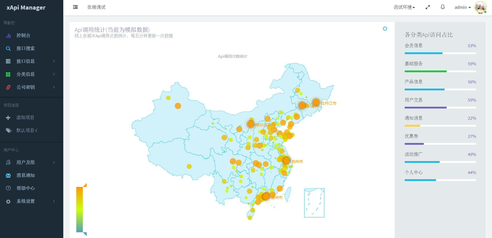
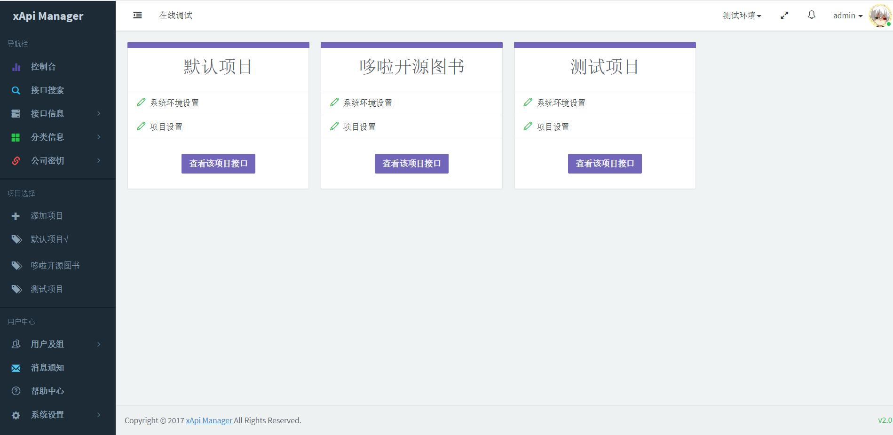
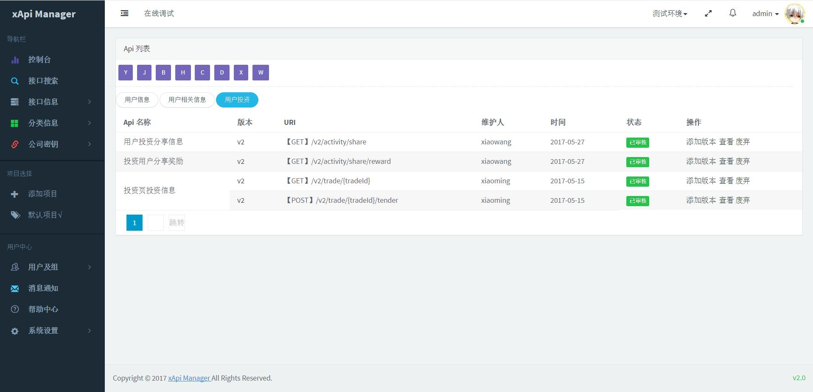
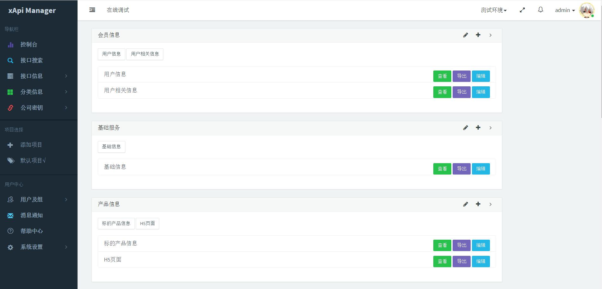
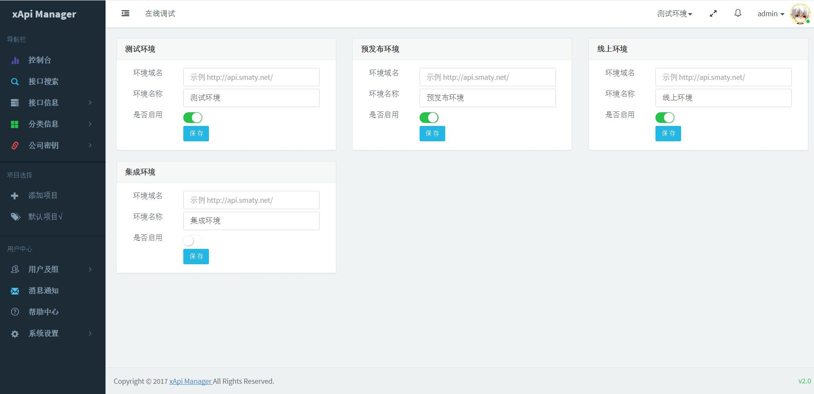
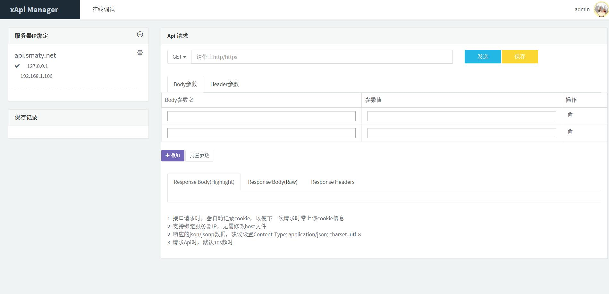

项目介绍
========


### Api Manager-哆啦接口管理平台
XAPI MANAGER -专业实用的开源接口管理平台，为程序开发者提供一个灵活，方便，快捷的API管理工具，让API管理变的更加清晰、明朗
### 特点
* 全站基于 Laravel 5.5  + Bootstrap + jQuery +layer3.0开发
* 开放源代码，开发者可以根据自己的需求自由使用和定制
* 让开发者更加专注于项目业务和逻辑的实现，及协同开发
* 支持多项目、多环境管理，支持消息通知及帮助中心


### v2.0.2 版本更新说明

1. 优化代码兼容性，已支持php5.6、php7.0、php7.1、php7.2

2. Api详情及在线调试，支持json、jsonp、xml、html格式的数据返回

3. 修复Api详情单击调试后请求方式错误的问题

4. 添加Api时，版本号长度改为12个字符

   ​

### v2.0 版本说明

支持了多项目多环境、企业密钥等若干改进和优化，欢迎大家下载使用，如果您在使用中遇到什么问题请及时向我们反馈。同时欢迎大家加入QQ交流群(623709829)，共同探讨一些技术问题、交流一些想法。

* 官方地址：http://xapi.smaty.net/ （admin/admin123）
* 项目部署及配置：http://www.smaty.net/t/xapi-manager (安装和升级请参考手册)
* 开源图书社区: http://www.smaty.net

我们的愿景是做最好的接口管理平台，如果您感兴趣，欢迎加入我们的开发团队

* 码云地址：https://git.oschina.net/duolatech/xapimanager
* github地址：https://github.com/duolatech/xApi-Manager

项目介绍
========
**控制台** 

**多项目设置** 

**Api列表** 

**Api分类** 

**Api环境设置** 

**Api调试**



##  一键安装及升级：

 针对很多用户反馈的v1.0安装问题，我们在v2.0采用了一键安装。

 当您配置好nginx或apache后，直接访问您的域名（如：http://www.xapi.com），会自动检查以下两步：

1. 自动检测是否存在.env文件，如果不存在的话，自动复制根目录下的.env.example重命名为.env文件（此时不用修改env文件的信息）。
2. 自动检查是否安装数据库，没有安装的话直接跳转到安装页面，该页面会检查您是否开启 php_curl，php_mbstring , php_openssl这些扩展，如果没有开启会提示您开启。符合条件后您可以输入数据库信息。单击安装后会导入数据库文件，并将数据库信息写入.env 文件（避免了手动修改的麻烦）

注意，如果您之前安装了xApi Manager v1.0版本的话，更新代码后，请单击在线升级，升级过程会导入新表和修改表字段。亲们，请一定要备份您的数据库，一定要备份、一定要备份，重要的事情说三遍。升级后管理员用户请检查一下项目成员的权限。


### 访问：

> 地址: http:// sitename /


> 帐户名: [admin@admin.com](mailto:admin@admin.com)


> 密码: admin123


issue处理

新版本检查 view/public/footer.blade.php, 会有新版本检查代码，可以注释掉

	$.get("/Sys/update",function(res,status){
	var checkUpdate = $.cookie('checkUpdate',1,{expires:7,path:'/'});
	if(status=='success' && res.status==200){
		var version = $(".versionInfo");
		version.find('label').text(res.message);
		version.find('a').prop('href', res.data.url);
		version.find('i').show();
	}
	});


**亲们，安装完成后别忘了，进行核心数据的配置，但愿你不会忘！**

** 核心配置即项目设置和系统环境配置：**


**1 . 单击系统环境配置后进入配置页面，默认开启了四个环境，请根据您的业务需求选择相应的环境。****环境域名即您的Api地址前缀，配置后您在查询接口详情时，xapi会自动获取相应环境的域名生成，api地址。**


**2. 单击项目设置，配置项目信息及项目权限组**


** 配置好后，xApi的更多功能就等着您去发现和使用**


**分权管理包括功能权限和数据权限，其中数据权限因为时间关系暂时没有开发完成，计划以后版本添加**

**功能权限：**


**当前分类分为两级，您可以根据您的需要添加分类信息**

项目部署后，接口分类中没有任何分类信息，请通过菜单栏添加分类(分类信息>>添加分类)，添加后点击接口分类便能看到分类信息。

通过菜单栏添加的分类，属于一级分类，您可以通过接口分类中的子分类添加二级分类。

接口列表搜索和添加Api时，都会用到二级分类，请提前添加。权限

 v2.0版本支持导出子分类接口列表到word文档，你可以自由修改word文档的接口信息。（v1.0版本导出的是pdf）


**接口列表中支持通过二级分类名称的首字母查询该分类下的所有接口，当您的鼠标移到某个字母时，就会出现相应的子分类，单击该分类就能查询到相应的Api**

**接口添加时，不论当前Api环境是什么，都统一保存在测试环境下。添加的Api都需要管理员审核，审核通过后才能发布到上一级环境中**

注意：发布Api时，Api将同步到当前环境的上一级环境，Api同步的顺序依次是（测试环境 >集成环境 >预发布环境 >线上环境）。如果您当前是测试环境，Api将同步到集成环境，同步成功后，你可以在网站顶部切换到集成环境，便能看到同步的Api。

添加接口时，gateway地址和本地的接口地址可以一致，也可以不一致。gateway地址用于app和web端调用，本地接口地址用于开发。

**接口详情已优化支持json、jsonp、xml、html的显示和输出**


我们在控制台模拟了一个统计各城市的Api请求量的实时地图，其中的数据是一些随机数。如果您打算实现一个真实的各城市请求量，请在根目录下config/project.php中开发一个类似[http://xapimanager.smaty.net/Statistics/v1/area](http://xapimanager.smaty.net/Statistics/v1/area) 的接口并替换该接口（返回字段参考该接口）。

另外我们在表mx_area中添加了中国的所有城市，方便您查询使用。


**[Laravel API文档生成](https://github.com/mpociot/laravel-apidoc-generator)**

To generate your API documentation, use the api:generate artisan command.  eg.


```
// API Group Routes
Route::group(array('prefix' => 'api/v1', 'middleware' => []), function () {
	// Custom route added to standard Resource
	Route::get('example/foo', 'ExampleController@foo');
	// Standard Resource route
	Route::resource('example', 'ExampleController');
});


// api:generate Commnad
php artisan api:generate --routePrefix="api/v1/*"
```

Available command options:

| Option                | Description                              |
| --------------------- | ---------------------------------------- |
| `output`              | The output path used for the generated documentation. Default: `public/docs` |
| `routePrefix`         | The route prefix to use for generation - `*` can be used as a wildcard |
| `routes`              | The route names to use for generation - Required if no routePrefix is provided |
| `middleware`          | The middlewares to use for generation    |
| `noResponseCalls`     | Disable API response calls               |
| `noPostmanCollection` | Disable Postman collection creation      |
| `useMiddlewares`      | Use all configured route middlewares (Needed for Laravel 5.3 `SubstituteBindings` middleware) |
| `actAsUserId`         | The user ID to use for authenticated API response calls |
| `router`              | The router to use, when processing the route files (can be Laravel or Dingo - defaults to Laravel) |
| `bindings`            | List of route bindings that should be replaced when trying to retrieve route results. Syntax format: `binding_one,id |
| `force`               | Force the re-generation of existing/modified API routes |
| `header`              | Custom HTTP headers to add to the example requests. Separate the header name and value with ":". For example: `--header 'Authorization: CustomToken'` |